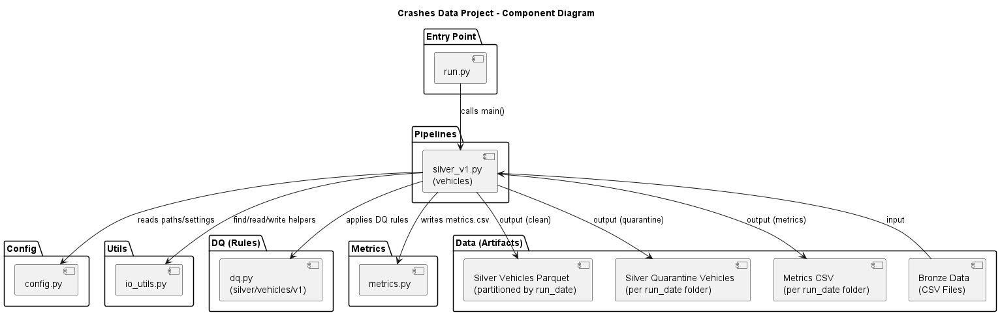

# Motor Vehicle Collisions – Vehicles Data Pipeline

This project implements a structured data engineering pipeline using the NYC Motor Vehicle Collisions – Vehicles dataset.

The goal is to move beyond exploratory notebooks and design a reproducible, scalable, and layered data architecture following modern data engineering principles.

---

## Project Overview

This pipeline processes raw CSV data (Bronze layer) and transforms it into a structured, typed, and partitioned Parquet dataset (Silver layer).

The project focuses on:

* Data contracts (schema validation)
* Clear dataset granularity (1 row = 1 vehicle)
* Layered architecture (Bronze → Silver → Gold)
* Partitioning strategy for performance
* Reproducible and maintainable pipelines
* AI-augmented development workflow

---

## Dataset

The raw dataset is **not included** in this repository due to GitHub file size limitations.

You can download the dataset from NYC Open Data:

Motor Vehicle Collisions – Vehicles  
https://data.cityofnewyork.us/Public-Safety/Motor-Vehicle-Collisions-Vehicles/h9gi-nx95

After downloading the CSV file, place it inside:

```
data/bronze/vehicles/full/
```

Example:

```
data/bronze/vehicles/full/vehicles_raw_YYYYMMDD.csv
```

The pipeline automatically detects the most recent CSV file in this directory.

---

## Architecture

```
Bronze (Raw CSV)
        ↓
Silver (Parsed, Typed, Partitioned Parquet)
        ↓
Gold (Aggregations and Analytics - upcoming)
```

---

## UML Documentation

To improve architectural clarity and formalize the system design, 
UML diagrams were created using **PlantUML**.

These diagrams provide a structured visualization of both the system 
architecture and the execution flow of the Silver pipeline.

They are located in:
docs/uml/

---

### Component Diagram

The Component Diagram represents the high-level architecture of the project.

It illustrates:

- Entry point (`run.py`)
- Silver pipeline module
- Configuration layer (`config.py`)
- Utility modules (`io_utils.py`, `dq.py`)
- Data artifacts (Bronze, Silver, Quarantine, Metrics)

This diagram documents module responsibilities, dependencies, 
and data flow between layers.



---

### Activity Diagram – Silver v1

The Activity Diagram documents the end-to-end execution flow 
of the Silver layer.

It represents:

- Bronze file discovery
- Schema validation
- Column selection and normalization
- Type parsing and derived column creation
- Data quality validation
- Drop vs. Quarantine decision logic
- Partitioned Parquet writing
- Metrics generation

This ensures the pipeline logic is explicit, traceable,
and aligned with data engineering best practices.


---

### Why UML?

Although many data engineering projects rely solely on code,
formal architectural documentation:

- Improves maintainability
- Reduces ambiguity
- Facilitates onboarding
- Supports scalability
- Elevates the project from exploratory analysis to production-oriented design

The UML diagrams are version-controlled alongside the codebase 
and should be updated whenever architectural changes occur.
### Data Layers

### Bronze
* Raw CSV files
* No transformations applied
* Immutable ingestion layer

### Silver (v1)
* Schema validation enforced
* Column selection based on a defined Data Dictionary
* snake_case column standardization
* Safe type parsing (dates, integers, nullable types)
* Derived `crash_datetime`
* Derived `crash_year`
* Partitioned Parquet output

### Gold (Planned)
* Aggregations
* Analytics-ready datasets
* Business-level metrics

---

## Project Structure

```
crashes-data-project/
│
├── data/
│   ├── bronze/
│   │   └── vehicles/
│   │       └── full/
│   │           └── vehicles_raw_YYYYMMDD.csv
│   │
│   ├── silver/
│   │   └── vehicles/
│   │       └── v1/
│   │           ├── crash_year=2023/
│   │           ├── crash_year=2024/
│   │           ├── crash_year=2025/
│   │           └── crash_year=2026/
│   │
│   └── gold/
│
├── src/
│   ├── config.py
│   ├── silver/
│   │   └── silver_v1.py
│   └── utils/
│       └── io_utils.py
│
├── requirements.txt
└── README.md
```

---

## Technologies Used

* Python 3.10+
* Pandas
* PyArrow
* Virtual Environment (venv)
* GitHub Copilot
* OpenAI Codex

AI tools were used as AI pair programming assistants to accelerate development while maintaining full architectural understanding and control over every transformation.

---

## Silver Layer Processing Steps

1. Locate the latest CSV file in the Bronze layer
2. Validate required schema columns
3. Select only target columns defined in the Data Dictionary
4. Standardize column names to snake_case
5. Trim string fields
6. Parse:
   * `crash_date` → Date
   * `vehicle_year` → Nullable Integer
7. Normalize `crash_time`
8. Create derived column:
   * `crash_datetime`
9. Create partition column:
   * `crash_year`
10. Drop rows with invalid partition key
11. Write partitioned Parquet files using PyArrow

---

## Dataset Granularity

The Silver dataset is modeled with:

**1 row = 1 vehicle involved in a collision**

This ensures consistent analytics and avoids ambiguity when joining with other datasets.

---

## How to Run

From the project root directory:

```
python -m src.silver.silver_v1
```

Make sure your virtual environment is activated before running the command.

---

## Future Improvements

* Gold layer aggregations (yearly metrics, driver profile analysis, vehicle trends)
* Data quality reporting
* Logging improvements
* CLI arguments for year-based execution
* Automated testing
* CI/CD integration

---

## Learning Goals

This project is designed to practice:

* Data lake architecture principles
* Schema contracts
* Partitioning strategy
* Pipeline reproducibility
* Clean project structure
* AI-augmented software development

---

Este projeto implementa um pipeline de engenharia de dados utilizando o dataset NYC Motor Vehicle Collisions – Vehicles.

A arquitetura segue o padrão em camadas:

Bronze → Silver → Gold

Na camada Silver (v1), o projeto realiza:

* Validação de schema
* Seleção de colunas com base em um Data Dictionary
* Padronização de nomes (snake_case)
* Parsing seguro de datas e tipos numéricos
* Criação da coluna derivada `crash_datetime`
* Criação da coluna de partição `crash_year`
* Escrita em formato Parquet particionado por ano

A granularidade definida é:

**1 linha = 1 veículo envolvido em colisão**

O objetivo é sair do modelo de notebook exploratório e evoluir para um pipeline estruturado, reproduzível e escalável, aplicando conceitos reais de engenharia de dados.

Ferramentas como GitHub Copilot e OpenAI Codex foram utilizadas como apoio no desenvolvimento, acelerando a implementação sem abrir mão do entendimento arquitetural.
